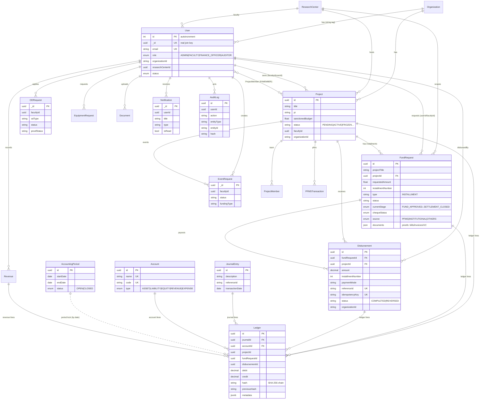

# Entity–Relationship Diagram

> Rendered with Mermaid. Associations are defined centrally in
> `finance-backend/src/models/index.js`. Note the schema uses a dual `id`/`_id`
> key convention (see PRODUCTION-READINESS.md); most User relationships join on the
> UUID `_id` with `constraints: false`, so they are not all backed by DB-level FKs.

## Key relationships in words

- A **Project** has many **FundRequests** (one per installment) and many
  **Disbursements**. Each **FundRequest** has many **Disbursements** (partial
  payouts), keyed by `(fundRequestId, installmentNumber)`.
- Every disbursement posts a balanced **JournalEntry** with two or more **Ledger**
  lines referencing **Accounts** (Expense debit / Bank credit).
- The **Ledger** is append-only and hash-chained; **AccountingPeriod** enforces
  period locks by transaction date.
- **Users** relate to almost everything by the UUID `_id` join key.
- **Organization** is a string tenant tag (`ORG_1`), not a hard FK.
